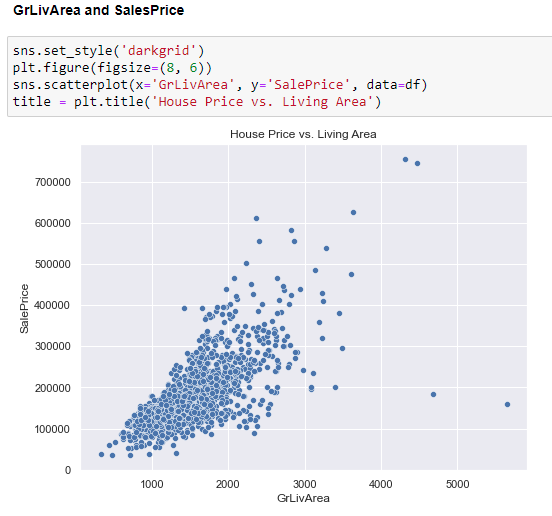

# House Price EDA
## Introduction
Buying a home has been seen as the “American Dream” for several generations. There are many factors that go into picking out the ideal home for the buyer, as well as determining the sales price for the seller. For this exercise, we will be using [Ames, Iowa Real Estate data set from Kaggle.com](https://www.kaggle.com/c/house-prices-advanced-regression-techniques/overview) to perform Exploratory Data Analysis (EDA) to identify key dependent variables that help determine the sales price of a house.

## Notebooks
- [MSDS422_Assignment1_Colab.ipynb](https://github.com/DrakeData/House_Price_EDA/blob/main/MSDS422_Assignment1_Colab.ipynb) performs an initial deep dive into the data, examining the null values and handling accordantly. The code exports ‘train_clean.csv’ and ‘test_clean.csv’ files that are saved in the data folder.
- [MSDS422_Assignment_2_Colab.ipynb](https://github.com/DrakeData/House_Price_EDA/blob/main/MSDS422_Assignment_2_Colab.ipynb) uses the clean data files from MSDS422_Assignment1 to run a simple linear regression model and a multiple regression model to predict SalePrice.

## Data Exploration
Before we start digging deep into the data, I always like to review the data dictionary if one is provided. In this case, there is a [‘data_description.txt’](https://github.com/DrakeData/House_Price_EDA/blob/main/data_description.txt) file that helps us understand the data values and what we should expect from the data set. One thing I noticed is that there is a lot of values that contain ‘NA’ as an actually value instead of a null value. We will need to handle this during the data cleanup process.

## Data Cleaning
Now let’s load the data into a pandas data frame and run descriptive statistics and visualizations to help understand the marginal distribution of the dependent variables.

The first thing I notice is that there is a count of 1460 values within the data frame. There are several columns that have null values, in which we will look into:

There are 34 columns within this data set that contain null values. To simplify what needs to be down, I have broken the data down into 3 groups:
**Group 1:**  Categorical variables where the nulls mean no feature.
-	For these variables, I will replace ‘NA’ with ‘None’
-	Variables affected: PoolQC, MiscFeature, Alley, Fence, FireplaceQu, GarageType, GarageFinish, GarageQual, GarageCond, BsmtQual, BsmtCond, BsmtExposure, BsmtFinType1, BsmtFinType2, and MasVnrType
**Group 2:** Numerical variables where nulls mean no feature
-	For these variables, I will replace ‘NA’ with ‘0’
-	Variables affected: GarageArea, GarageCars, BsmtFinSF1, BsmtFinSF2, BsmtUnfSF, TotalBsmtSF, BsmtFullBath, BsmtHalfBath, and MasVnrArea
**Group 3:** Other null variables – these require a little more detail
-	Functional, MSZoning, Electrical, KitchenQual, Exterior1st, Exterior2nd, SaleType, and Utilities 'NA' will be replaced with their most frequent value (mode)
-	LotFrontage 'NAs' will be imputed with its mean per house based on the mean in the neighborhood
-	GarageYrBlt impute with YearBuilt (assuming that the garage is built at the same time with the house)

## Data Analysis
After the data has been cleaned up, we can begin investigating potential predictors of a home’s sale price. The first thing I did was check to see if there are any correlation with the numeric variables and sale price:

We can see that OverallQual, and GrLivArea have a decently high correlation to sale price. Let us dig a little deeper by visualizing them:

From the above visualization, we can see that the higher the quality of the house correlates with a higher sale price.

Looking at the above scatter plot, there is a correlation between the above grade (ground) living area and sale price. We can also see there are a couple outliers that have a high living area and a low sale price. We would want to remove these outliers as it can affect any future models that we decide to use with this data later on.

Lastly, I wanted to see if there was a correlation with fireplace quality and sale price:

Interesting discovery: it’s better to not have a fireplace than a poor quality fireplace. Having an excellent quality fireplace does help increase the sale price.

## Improving the Data Set
There are a couple data points that I have added to the data set:
-	Total square feet of the house: add square feet on the first floor, second floor, and basement
-	Total bathrooms in the house: add all the full and half bathrooms on the first floor and basement
-	Age of house: subtract YearBuilt column from YrSold
-	Was the house remodeled (Y/N): check to see if YearRemodAdd column equals YearBuilt

## Scaling the Dependent Variable
Since the scale of the different potential predictors of the dependent variable are vary, we want to scale the variables to a more standard range. This is done by performing MinMax Scaling and Standard Scaling.
-	**MinMax Scaling** fits the data values and transforms them to correspond to 1 and 0 (Bhandari 2021).
The formula for normalization:

-	**Standard Scaling** centers the values around the mean with a unit standard deviation. It shifts the values rescales them to be in a range between 1 and 0 (Bhandari 2021)
The formula for standardization:

For this exercise, we will be scaling the dependent variables of OverallQual, GrLivArea, and FireplaceQu against SalePrice. We will first start by just looking at the data without scaling:

From the visualization, we can see that OverallQual and GrLivArea have strong correlation with SalePrice. FireplaceQu (far right graph) was not as strong as I was hoping, in which I will remove it from the standardization.

Next, I will us MinMax Scaler to normalize the data:

From the normalize data, you can see that it keeps the similar skewness of the data and puts it in a range between 0 and 1.

Finally, let’s look the Standard Scaling of the data:

The data points are scaled by calculating the mean and the standard deviation parameters to “fit” the data.

## References:
Bhandari, Aniruddha. “Feature Scaling: Standardization vs Normalization.” Analytics Vidhya, August 26, 2021. https://www.analyticsvidhya.com/blog/2020/04/feature-scaling-machine-learning-normalization-standardization/#h2_6.

Kaggle: House Prices - Advanced Regression Techniques. https://www.kaggle.com/c/house-prices-advanced-regression-techniques/overview

## Repository Information:
Created by: Nicholas Drake

Created Date: 01/09/2022

MSDS 422: Practical Machine Learning
